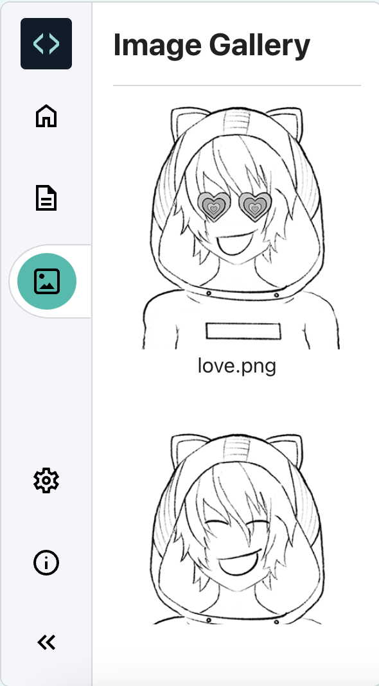

The starter file has a library of useful images.

Click on the 'Image gallery' icon.


Scroll through the image library and make a note of the file name of an image you would like to use in your webpage.



Add your image to the `<main></main>` in `index.html` so that it appears on your webpage.

## --- code ---

language: html
filename: index.html
line_numbers: true
line_number_start: 32
line_highlights: 35
--------------------------------------------------------

```
<!-- The main content for the webpage goes between the main tags -->
<main>
  Lorem ipsum dolor sit amet. 
  
   
</main>
```

\--- /code ---
